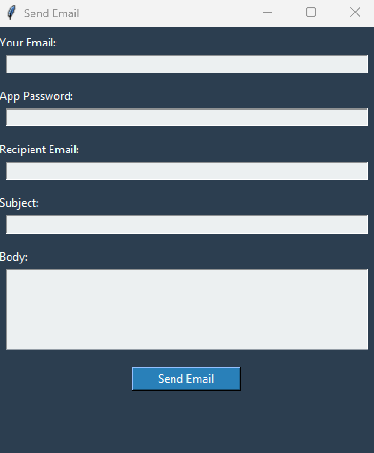
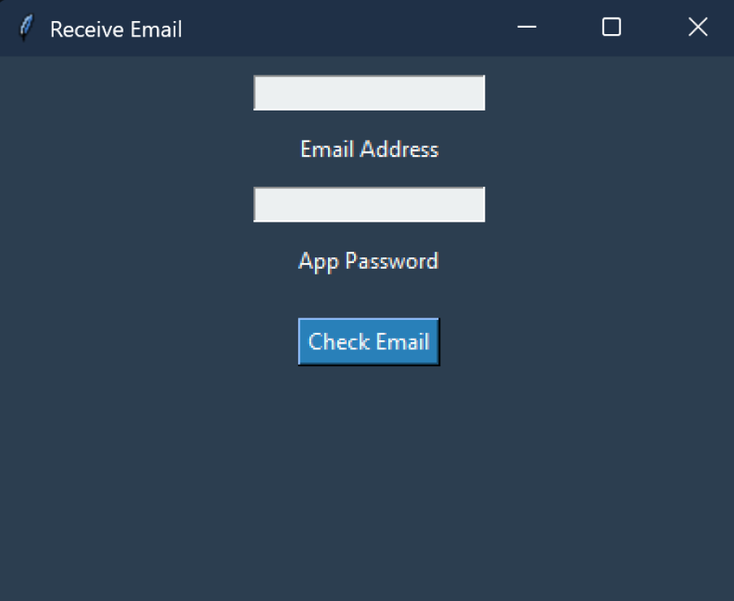

# Email Client Application

This repository contains a Python-based **Email Client Application** developed for a Networks Lab assignment. The application allows users to send and receive emails securely using Gmail's SMTP and IMAP protocols, respectively. It features a user-friendly graphical user interface (GUI) built with `tkinter` and desktop notifications powered by the `plyer` library.

## Features

- **Send Emails** (`send_email.py`):
  - Send emails securely via Gmail's SMTP server (port 587) with TLS encryption.
  - GUI for entering sender email, app password, recipient email, subject, and body.
  - Handles authentication errors with user feedback via message boxes.
- **Receive Emails** (`receive_email.py`):
  - Fetch the latest email from the Gmail inbox using IMAP (port 993) with SSL.
  - Display the sender, subject, and body in a message box.
  - Show desktop notifications for new emails using `plyer`.
- Input validation ensures all required fields are filled.
- Secure credential handling (requires Gmail app-specific password).

## Prerequisites

- **Python 3.6+** (ensure Python is installed).
- Required Python libraries:
  - `tkinter` (included with standard Python installations).
  - `plyer` (for desktop notifications).
- A Gmail account with an **app-specific password**. To generate one:
  1. Enable 2-Step Verification in your Google Account settings.
  2. Navigate to **App passwords** &gt; Generate a new app password for "Mail".

## Installation

1. Clone the repository:

   ```bash
   git clone https://github.com/your-username/email-client-application.git
   cd email-client-application
   ```
2. Install the required library:

   ```bash
   pip install plyer
   ```
3. Verify `tkinter` is available (included with Python).

## Usage

### Sending Emails (`send_email.py`)

1. Run the script:

   ```bash
   python send_email.py
   ```
2. In the GUI:
   - Enter your Gmail address in the "Your Email" field.
   - Enter your app-specific password in the "App Password" field.
   - Provide the recipient's email, subject, and email body.
3. Click **Send Email**.
4. A message box will confirm success or display an error (e.g., authentication failure).

### Receiving Emails (`receive_email.py`)

1. Run the script:

   ```bash
   python receive_email.py
   ```
2. In the GUI:
   - Enter your Gmail address in the "Email Address" field.
   - Enter your app-specific password in the "App Password" field.
3. Click **Check Email**.
4. The latest email's sender, subject, and body will appear in a message box, with a desktop notification.

## Screenshots

- **Send Email Interface**:
  
  
  *GUI for sending emails with input fields and send button.*

- **Receive Email Interface**:
  
  
  *GUI for receiving emails with input fields and check button.*
  
## Code Overview

### `send_email.py`

- Uses `smtplib` for SMTP communication (Gmail, port 587, TLS).
- Constructs emails with `email.mime` (`MIMEMultipart`, `MIMEText`).
- GUI built with `tkinter` for input (email, password, recipient, subject, body).
- Handles errors (e.g., `SMTPAuthenticationError`) with `messagebox` feedback.

### `receive_email.py`

- Uses `imaplib` for IMAP communication (Gmail, port 993, SSL).
- Fetches and parses the latest email using the `email` module.
- Displays email details via `tkinter` and sends notifications via `plyer`.

## Testing

The application was tested as follows:

1. Sent multiple test emails to a Gmail account to confirm delivery.
2. Tested incorrect credentials to verify error handling.
3. Validated that received emails displayed correctly.
4. Ensured no Google security warnings were triggered.

## Notes

- Use a Gmail **app-specific password** (not your regular password) for security.
- Install `plyer` for desktop notifications (`pip install plyer`).
- The GUI uses a dark theme (`#2C3E50` background) with light input fields (`#ECF0F1`).
- The application is designed for Gmail but can be adapted for other email providers by modifying SMTP/IMAP server settings.

## Dependencies

- Python libraries: `smtplib`, `email`, `tkinter`, `plyer`.
- No external services beyond Gmail's SMTP and IMAP servers.

## Conclusion

This Email Client Application offers a simple, secure, and user-friendly way to send and receive emails using Python. It demonstrates SMTP and IMAP protocol usage, GUI development with `tkinter`, and notifications with `plyer`. The application is ideal for educational purposes and can be extended with features like email attachments or multi-account support.
